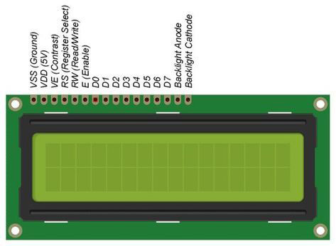

# Sistema de medición de Temperatura con LCD
Como es básico dentro de cualquier lugar en el que nos encontramos 
medir la temperatura del ambiente así como de su humedad relativa
para diversos propósitos o como un simple entretenimiento, creé de
manera sencilla una rutina o Sketch como le llaman en el mundo de 
Arduino para medir sin necesidad de estar conectados al puerto 
serial de una computadora, solo es necesario una placa de Arduino
y un display de cristal líquido o LCD, un sensor DHT11 montado en 
una placa y la fuente de alimentación de 5[V], para ésta implemen-
tación fueron utilizados:

	° Placa Arduino Mega 2560 (opcional y modificable para 
	  cualquier microcontrolador).
	° Sensor de temperatura DHT11 (Puede modificarse por un 
	  DHT22 -Tiene mayor presición-).
	° LCD simple (También puede modificarse por uno con luz
	  de fondo).
	° Fuente de alimentación de 5[V].

Adjunto algunas fotografías útiles, así como la configuración de 
los pines, como lo indica el código, las referencias se encuentran
en:
	° https://create.arduino.cc/projecthub
	° http://www.arduino.cc/en/Tutorial/LiquidCrystalDisplay
	° https://hetpro-store.com/TUTORIALES/sensor-dht11/

## Imagenes

Sensor DHT11 en placa implemntado.

Display de Cristal Líquido similar al implementado, solo se tiene
que omitir los últimos dos pines de alimentación del led.

P.D.:Solo generé este código con la intención de ejemplificar,
queda libre su modificación para ser implementado con otros 
actuadores.

##Licenciamiento##
El planteamiento de tareas, ejercicios y actividades que forman parte
de este repositorio, así como sus resoluciones, están amparadas por la
licencia _Creative Commons Attribution 4.0 International_
([CC BY 4.0](https://creativecommons.org/licenses/by/4.0/)).

Puedes Consultar el texto completo de la licencia
[consultar el texto completo de la licencia](./COPYING.md).
